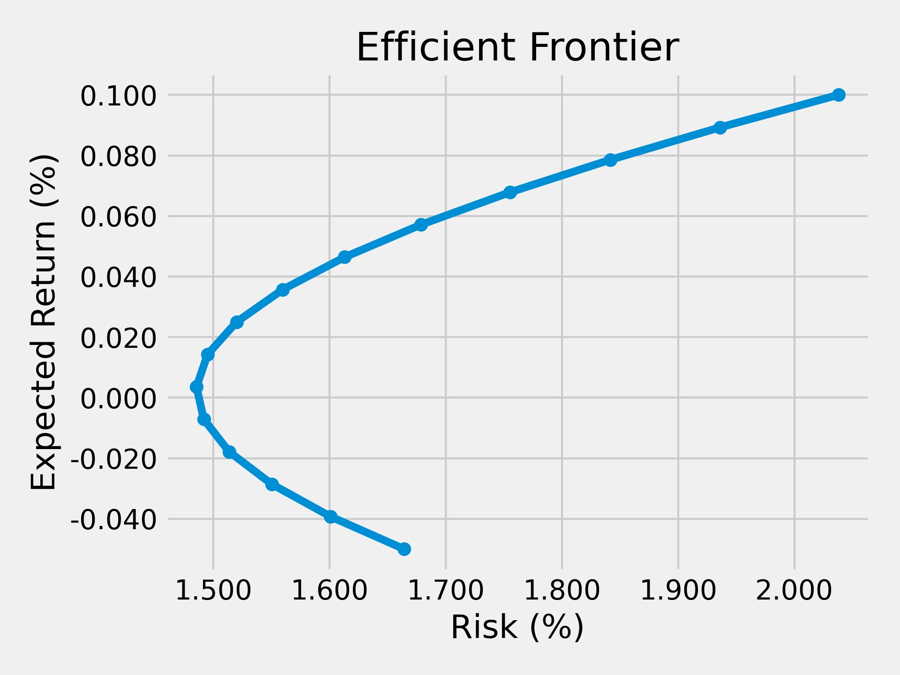
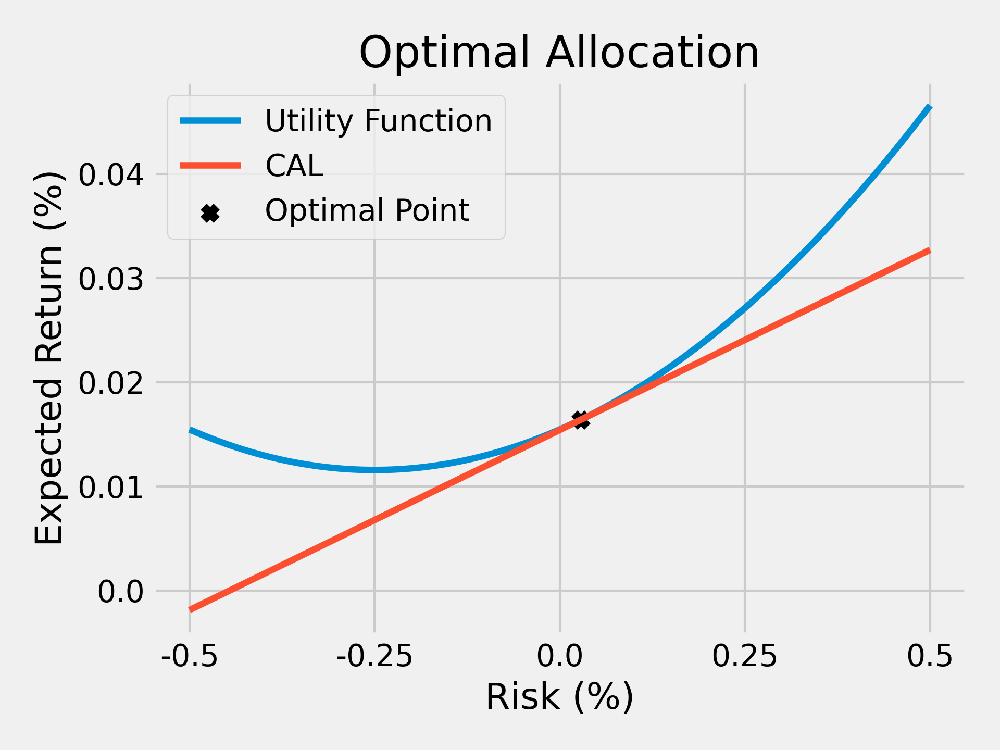

# Portfolio

> [Modern portfolio theory - Wikipedia](https://en.wikipedia.org/wiki/Modern_portfolio_theory)

## Efficient Frontier

### Model

<!-- $$
\begin{split}
\min_{\boldsymbol{w}} ~~& \sigma_P^2 = \sum_i\sum_j w_i w_j \sigma_i\sigma_j \\
\text{s.t.}           ~~& \boldsymbol{w}^\top \boldsymbol{1} = 1             \\
                      ~~& \boldsymbol{w}^\top \boldsymbol{\mu} = \mu_P       \\
\end{split}
$$ -->


### Usage

```python
# you can specify your favorite arguments
bash frontier.sh
# or use default arguments
python frontier.py
```

### Result



## Asset Allocation

### Model

<!-- $$
\begin{split}
\max_{\mu,\sigma} ~~& U = \mu-\frac12 A\sigma^2 \\
\text{s.t.} ~~& \mu=r_F + \frac{\sigma}{\sigma_P} (\mu_P-r_F) \\
\end{split}
$$ -->


> Subscript clarification:
>
> - F is for "risk-**f**ree"
> - P is for "**p**ortfolio"

### Usage

```bash
python allocation.py
```

### Result



## Data

There is only one sample csv file [`2011-01-31.csv`](./data/2011-01-31.csv) in `./data/`. Collect other data by your self.
